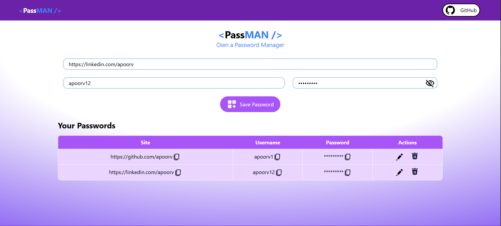

# ManagePass

A password manager application built with React and Vite.



## Features

-   Add, Edit, and Delete passwords
-   Copy passwords to clipboard
-   View passwords
-   Responsive design

## Technologies Used

-   React
-   Vite
-   Tailwind CSS
-   Mongodb
-   Node.js
-   Express.js
-   React Toastify
-   LordIcon
-   UUID
-   CORS

## Installation

1.  Clone the repository:

    ```bash
    git clone <repository-url>
    ```

2.  Navigate to the project directory:

    ```bash
    cd ManagePass
    ```

3.  Install dependencies:

    ```bash
    npm install
    ```

## Backend Setup

1.  Navigate to the backend directory:

    ```bash
    cd backend
    ```

2.  Install backend dependencies:

    ```bash
    npm install
    ```

3.  Create a `.env` file in the `backend` directory and add your MongoDB connection string:

    ```
    MONGO_URI="MONGODB_API"
    ```

4.  Run the backend server:

    ```bash
    node server.js
    ```

## Frontend Development

1.  Navigate back to the root directory:

    ```bash
    cd ..
    ```

2.  Start the development server:

    ```bash
    npm run dev
    ```

3.  Open your browser and navigate to `http://localhost:5173`.

## Scripts

-   `dev`: Starts the development server
-   `build`: Builds the project for production
-   `lint`: Runs ESLint on the project
-   `preview`: Starts a production preview server

## Contributing

Contributions are welcome! Please open an issue or submit a pull request.